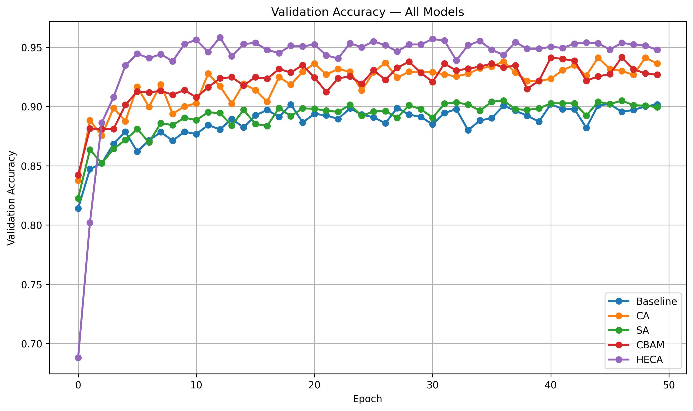
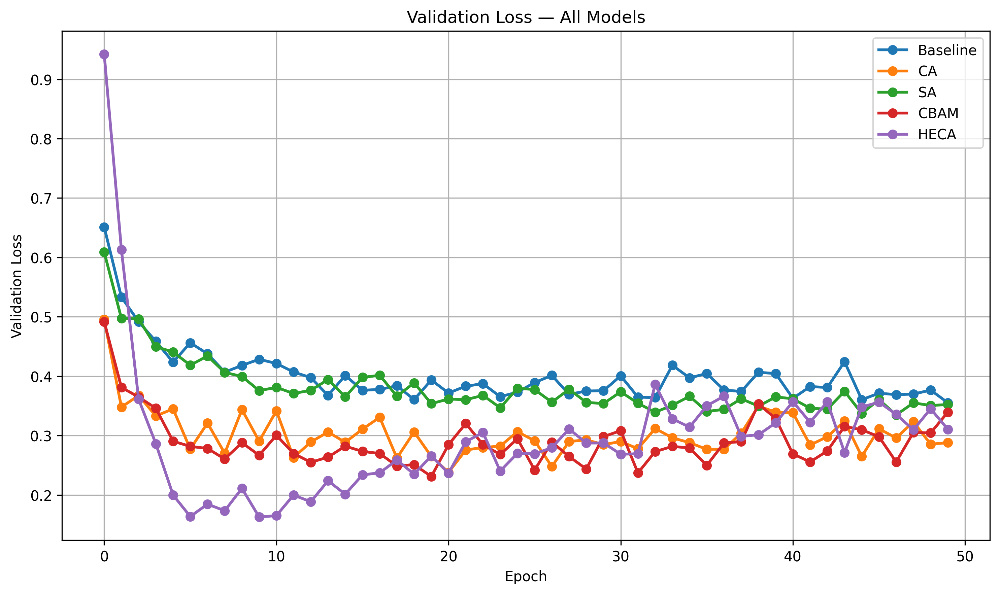
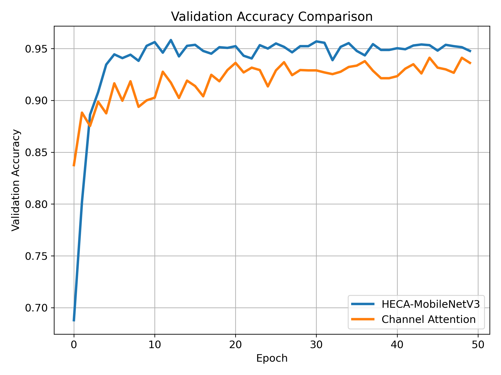
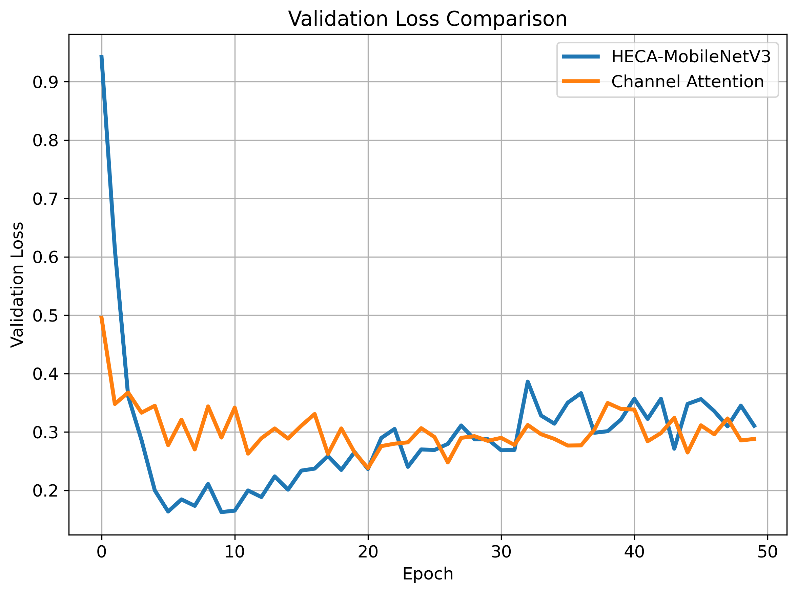
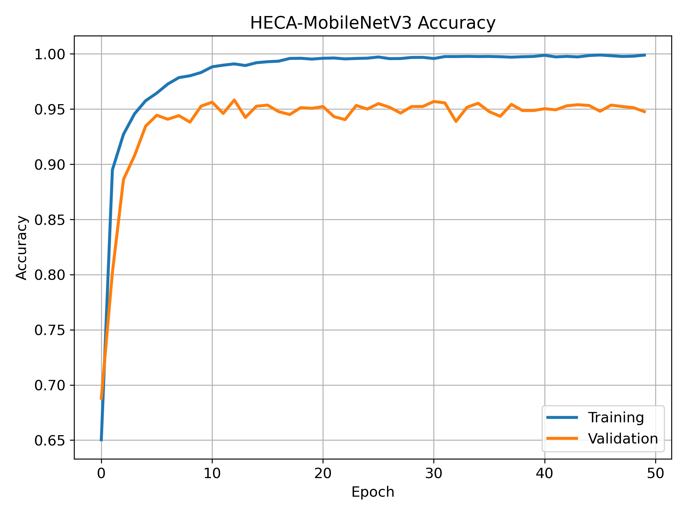
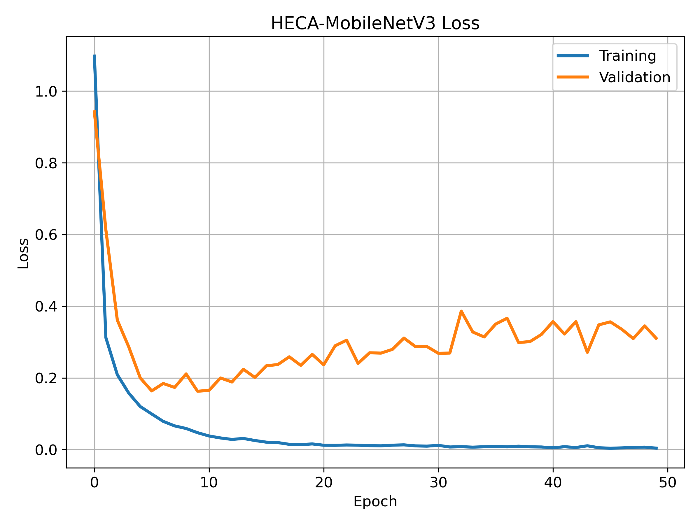
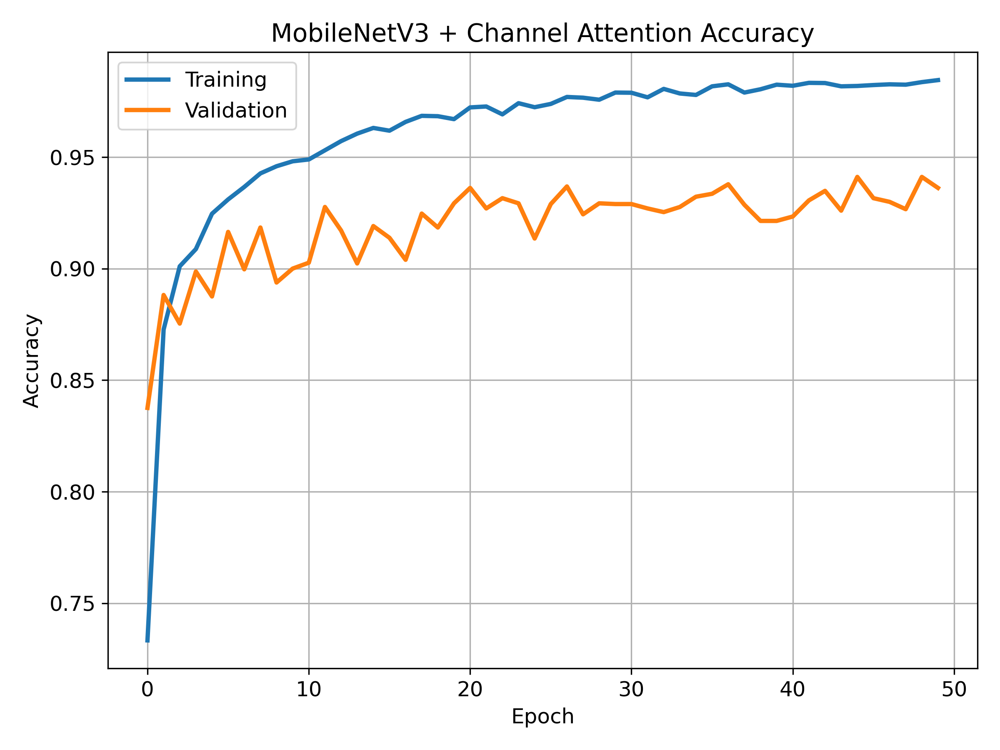
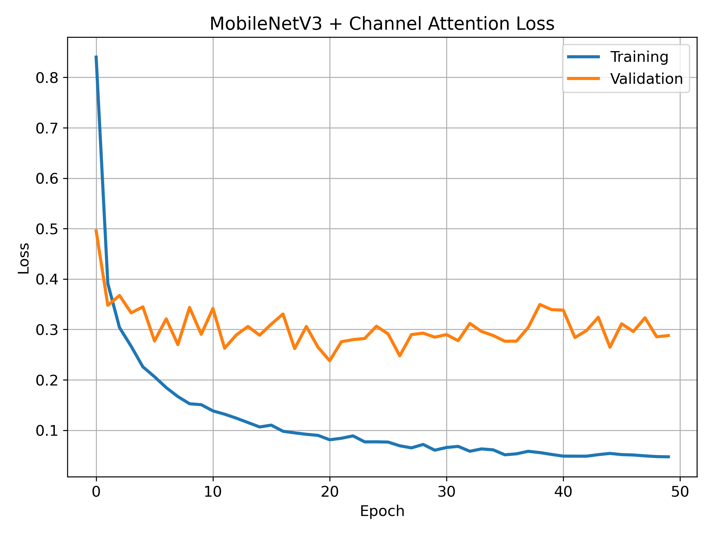

# 🌽 HECA: Hybrid Efficient Channel Attention for Maize Disease Classification

> **Implementation and evaluation of Hybrid Efficient Channel Attention (HECA) integrated with MobileNetV3 for automated maize leaf disease classification.**


---

# 📖 Overview

Early detection of maize leaf diseases plays a crucial role in improving crop productivity and reducing agricultural losses. Deep Convolutional Neural Networks (CNNs) have demonstrated remarkable performance in plant disease recognition; however, conventional attention mechanisms often fail to capture both global and fine-grained channel dependencies efficiently.

This repository presents the implementation of **Hybrid Efficient Channel Attention (HECA)** built upon **MobileNetV3** and experimentally compares it against several popular attention mechanisms.

The evaluated architectures include:

- MobileNetV3 (Baseline)
- MobileNetV3 + Spatial Attention (SA)
- MobileNetV3 + Channel Attention (CA)
- MobileNetV3 + CBAM
- **HECA-MobileNetV3 (Proposed)**

The proposed HECA architecture achieves the best overall classification performance while maintaining lightweight computational complexity.

---

# 📂 Repository Structure

```text
HECA-MAIZE-EXPERIMENTS/
│
├── failed_implementations/      # Experimental implementations
│
├── logs/                        # Training logs
│
├── models/                      # Saved trained models
│
├── notebooks/
│   ├── 01_Tomato_Baseline+CA+SA.ipynb
│   ├── 02_Tomato_CBAM+HECA.ipynb
│   ├── heca-50-epoch-final-implementation.ipynb
│   └── heca-accuracy-and-loss-and-roc-curves.ipynb
│
├── results/    #accuracy, loss, roc curves & reports
│   │
├── .gitignore
├── LICENSE
└── README.md
```

---

# 📊 Dataset

**Maize Leaf Disease Dataset**

- Multi-class Image Classification
- RGB Leaf Images
- Deep Learning Benchmark Dataset

> Replace this section with the official dataset citation and download link.

---

# 🏆 Experimental Results

| Model | Accuracy |
|---------|----------|
| MobileNetV3 | 89.38% |
| MobileNetV3 + Spatial Attention | 89.61% |
| MobileNetV3 + Channel Attention | 92.34% |
| MobileNetV3 + CBAM | 92.90% |
| **HECA-MobileNetV3 (Proposed)** | **95.96%** |

---

# 📈 Overall Validation Accuracy

<p align="center">

</p>

<p align="center">
<b>Figure 1.</b> Validation accuracy comparison among all evaluated attention mechanisms.
</p>

---

# 📉 Overall Validation Loss

<p align="center">

</p>

<p align="center">
<b>Figure 2.</b> Validation loss comparison among all evaluated attention mechanisms.
</p>

---

# 🚀 HECA vs Channel Attention

<p align="center">


</p>

<p align="center">
<b>Figure 3.</b> Comparative validation performance of HECA and conventional Channel Attention.
</p>

---

# 📈 HECA Learning Curves

<p align="center">


</p>

<p align="center">
<b>Figure 4.</b> Training and validation accuracy/loss curves of HECA-MobileNetV3.
</p>

---

# 📈 Channel Attention Learning Curves

<p align="center">


</p>

<p align="center">
<b>Figure 5.</b> Training and validation accuracy/loss curves of MobileNetV3 with Channel Attention.
</p>

---

# 📋 Evaluation Metrics

Each architecture was evaluated using:

- Accuracy
- Precision
- Recall
- F1-score
- Confusion Matrix
- ROC Curve
- Training Accuracy
- Validation Accuracy
- Training Loss
- Validation Loss

Classification reports, confusion matrices, ROC curves, training logs, and comparative plots are available in the **results/** directory.

---

# 🔬 Experimental Pipeline

```
Dataset
      │
      ▼
Image Preprocessing
      │
      ▼
MobileNetV3 Backbone
      │
      ├── Baseline
      ├── Spatial Attention
      ├── Channel Attention
      ├── CBAM
      └── HECA (Proposed)
      │
      ▼
Model Training
      │
      ▼
Evaluation
      │
      ├── Accuracy
      ├── Precision
      ├── Recall
      ├── F1-score
      ├── ROC Curve
      ├── Confusion Matrix
      └── Comparative Analysis
```

---

# 💡 Key Findings

- HECA achieved the highest validation accuracy among all evaluated models.
- The proposed attention mechanism demonstrated faster convergence during training.
- HECA produced lower validation loss than conventional Channel Attention and CBAM.
- Comparative experiments indicate that HECA provides a better balance between feature representation and computational efficiency.
- The proposed model consistently outperformed baseline MobileNetV3 across all evaluation metrics.

---

# ⚙️ Installation

Clone the repository:

```bash
git clone https://github.com/redhead-coffee/heca-maize-experiments.git

cd heca-maize-experiments
```

Install dependencies:

```bash
pip install -r requirements.txt
```

---

# 📓 Notebooks

| Notebook | Description |
|-----------|-------------|
| 01_Tomato_Baseline+CA+SA.ipynb | Baseline, Spatial Attention and Channel Attention experiments |
| 02_Tomato_CBAM+HECA.ipynb | CBAM and proposed HECA implementation |
| heca-50-epoch-final-implementation.ipynb | Final training implementation |
| heca-accuracy-and-loss-and-roc-curves.ipynb | Evaluation, visualization and comparative analysis |

---

# 📁 Results

The repository provides:

- Trained Models (.keras)
- Classification Reports
- Training Logs
- ROC Curves
- Confusion Matrices
- Accuracy & Loss Curves
- Comparative Performance Plots
- CSV Evaluation Reports

---

# 📚 Citation

If you find this repository useful in your research, please consider citing the associated publication.


---
